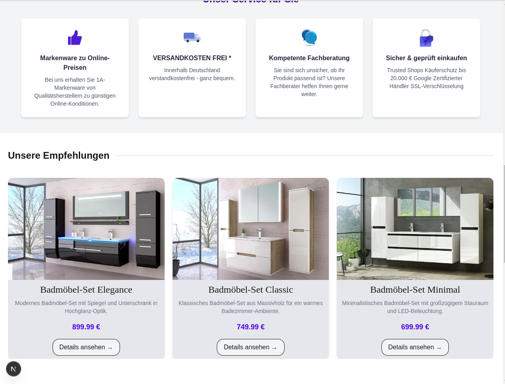

# 🛍️ Modern E-Commerce Frontend

Ein vollständig responsives und modernes E-Commerce-Frontend, entwickelt mit **Next.js** und **Tailwind CSS**. Ziel ist es, eine ansprechende Shop-Erfahrung mit klarer Navigation, Filterfunktionen und einem funktionsfähigen Warenkorb zu bieten.

---

## 📸 Vorschau

> *(Screenshots können später ergänzt werden)*





---

## 🚀 Features

- 🔍 **Dynamische Kategorieseiten & Produkt-Detailseite**
  - Kategorien und Unterkategorien mit Sidebar-Navigation

- 🛒 **Warenkorb-Funktion**
  - Produkte hinzufügen, entfernen, Menge anpassen
  - Zwischensumme wird automatisch berechnet
- 🖼️ **Produktdetailseiten**
  - Einzelansicht mit Beschreibung, Bild, Preis und "In den Warenkorb"-Button
- 💡 **Suchfunktion**
  - Automatische Vorschläge während der Eingabe
  - Suchergebnisseite mit relevanten Treffern
- 📱 **Responsives Design**
  - Optimiert für Desktop, Tablet und Mobile
- ⚙️ **Modularer Aufbau**
  - Wiederverwendbare Komponenten (Produktkarte, Sidebar, Navbar, Productgrid, Productcard, etc.)

---

## 🧱 Technologien

| Bereich             | Technologie           |
|--------------------|------------------------|
| Framework          | [Next.js](https://nextjs.org/) |
| Styling            | [Tailwind CSS](https://tailwindcss.com/) |
| State Management   | React Hooks (`useState`, `useEffect`, `Zustand`) |
| Deployment         | Vercel |

---

## 🗂️ Projektstruktur

```bash
├── app/
│   ├── [category]/                     # Kategorieseite
│   ├── [subcategory]/                  # Unterkategorie-Seite
│   ├── [id]/                           # Produktdetailseite
│   ├── about-us/                       # Info-Seite "Über uns"
│   ├── cart/                           # Warenkorb-Seite
│   ├── checkout/                       # Checkout-Seite
│   ├── search/
│   │   └── [query]/                    # Suchergebnisseiten (dynamisch)
│   ├── thank-you/                      # Abschluss-Seite nach Kauf
│   ├── layout.js                       # Globales Layout
│   └── page.js                         # Startseite

├── components/                         # Wiederverwendbare UI-Komponenten
│   ├── CategorySidebar.jsx
│   ├── CheckoutForm.jsx
│   ├── CheckoutSummary.jsx
│   ├── Footer.jsx
│   ├── Hero.jsx
│   ├── ImageGallery.jsx
│   ├── Navbar.jsx
│   ├── ProductCard.jsx
│   ├── ProductCarousel.jsx
│   ├── ProductGrid.jsx
│   └── SearchBar.jsx
│   └── ... (weitere Komponenten)

├── lib/                                # Statische Daten
│   ├── categories.js
│   ├── flatProducts.js
│   └── products.js

├── public/
│   └── images/                         # Produktbilder, Logos, etc.

├── styles/                             # Globale Styles (optional)
│
└── README.md                           # Projektbeschreibung
